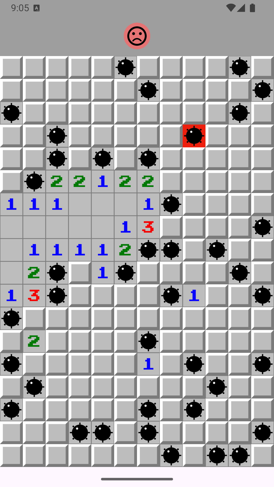

# 💣 Campo Minado em Flutter

Jogo de Campo Minado desenvolvido em Flutter, com abertura em cascata, marcação de bandeiras e detecção automática de vitória e derrota.
A interface é totalmente responsiva e utiliza um emoji no topo para indicar o estado atual da partida.

#📱 Demonstração
<p align="center">
	
</p>


O tabuleiro ajusta linhas e colunas dinamicamente conforme a área disponível.

Emoji no topo indicando o estado do jogo:

🟡 Amarelo: jogo em andamento

🟢 Verde: vitória

🔴 Vermelho: derrota

# 🎮 Interações

Toque curto: abre o campo

Toque longo: alterna marcação de bandeira

# ✨ Funcionalidades

Abertura de campos com efeito cascata quando a vizinhança é segura.

Contagem de minas adjacentes (0–8) com imagens dedicadas.

Marcação e desmarcação de bandeiras.

Vitória quando todos os campos seguros estão abertos e as minas marcadas.

Derrota ao abrir uma mina, com revelação visual de todas as bombas.

Reinício rápido da partida através de botão no topo da tela.

 #🧠 Conceitos Trabalhados

Modelagem das regras do jogo em classes Dart (Campo, Tabuleiro).

Uso de StatefulWidget para controle de estado local.

Comunicação entre componentes via callbacks:

onAbrir

onAlternarMarcacao

Uso de exceções para controle de fluxo (ExplosaoException).

Layout responsivo com LayoutBuilder e cálculo dinâmico da grade.

# 🗂️ Estrutura Principal
```
lib/
 ├── models/
 │   ├── campo.dart
 │   ├── explosion_exception.dart
 │   └── tabuleiro.dart
 ├── components/
 │   ├── tabuleiro_widget.dart.dart
 │   ├── campo_widget.dart
 │   └── resultado_widget.dart
 ├── screens/
 │   └── campo_minado_app.dart
 └── main.dart
```

# 🧑‍💻 Tecnologias e Pacotes

Flutter 3.x

Dart 3.x

Material Widgets:

MaterialApp

InkWell

LayoutBuilder

Image.asset


# 🔎 Lógica do Jogo (Resumo)
📦 Campo

adicionarVizinho: inclui vizinhos em um raio 1 (incluindo diagonais).

abrir:

Se for minado → lança ExplosaoException.

Se a vizinhança for segura → abre campos vizinhos em cascata.

alternarMarcacao: marca/desmarca bandeira.

qtdeMinasNaVizinhanca: conta minas ao redor.

resolvido: mina marcada ou campo seguro aberto.

# 🧱 Tabuleiro

Cria a matriz de Campo.

Distribui minas aleatoriamente.

Define vizinhança de cada campo.

resolvido: verifica se todos os campos estão corretos.

revelarBombas: usado na derrota.

reiniciar: recria o tabuleiro.

# 🎮 CampoMinadoApp

Estado _venceu:

null → jogando

true → vitória

false → derrota

Ao abrir um campo:

Trata explosão

Revela bombas

Verifica vitória

Layout responsivo com cálculo automático de linhas e colunas.

debugShowCheckedModeBanner: false.

# 🧩 Widgets

ResultadoWidget:

Mostra emoji e cor conforme o estado do jogo.

Permite reiniciar a partida.

CampoWidget:

Escolhe imagem conforme o estado:

fechado

bandeira

aberto (0–8)

bomba

bomba explodida

Dispara onTap e onLongPress.


